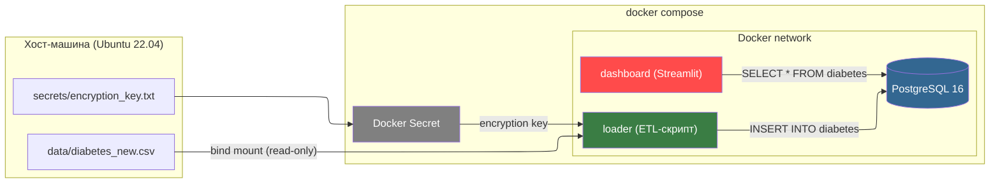
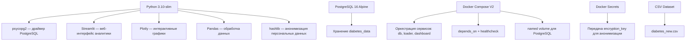

# Лабораторная работа 2. Упаковка многокомпонентного аналитического приложения с помощью Docker и Docker Compose.

## Выполнила Савкина Мария, группа БД-251м

## Вариант 25

*Бизнес-задача:* Диабет (Риски)	

*Проектная задача:* loader: Скрипт анонимизации данных перед загрузкой.	

*Техническое задание:* Использовать секреты (Docker Secrets или эмуляцию через файлы), чтобы передать ключи шифрования, а не через ENV.

## 1. Архитектура решения.


## 2. Технологический стек


## 3. Структура проекта
```
LW_02/
├── app/
│   ├── dashboard.py
│   ├── Dockerfile
│   ├── loader.py
│   └── requirements.txt
├── data/
│   └── diabetes_new.csv
├── secrets/
│   └── encryption_key.txt
├── .env
└── docker-compose.yml
```

## 4. Описание компонентов

### 4.1. Датасет diabetes_new.csv

Датасет получен из открытого набора данных с Kaggle: https://www.kaggle.com/datasets/mathchi/diabetes-data-set путём добавления полей FirstName и SecondName для дальнейшей анонимизации данных в рамках проектной задачи Варианта 25.

Поля набора данных:
| Поле                        | Тип       | Описание                                                                                   |
|------------------------------|----------|-------------------------------------------------------------------------------------------|
| Pregnancies                  | INT      | Количество беременностей                                                                   |
| Glucose                      | INT      | Концентрация глюкозы в плазме через 2 часа после перорального теста на толерантность       |
| BloodPressure                | INT      | Диастолическое артериальное давление (мм рт. ст.)                                         |
| SkinThickness                | INT      | Толщина кожной складки на трицепсе (мм)                                                  |
| Insulin                      | INT      | Уровень инсулина в сыворотке крови через 2 часа (мМЕ/мл)                                  |
| BMI                          | FLOAT    | Индекс массы тела (вес в кг / (рост в м)²)                                                 |
| DiabetesPedigreeFunction     | FLOAT    | Функция родословной для выявления риска диабета                                           |
| Age                          | INT      | Возраст пациента (лет)                                                                    |
| Outcome                      | INT      | Переменная класса (0 — нет диабета, 1 — диабет)                                          |
| FirstName                    | STRING   | Имя пациента                                                                             |
| LastName                     | STRING   | Фамилия пациента                                                                         |

### 4.2 Dockerfile (`app/Dockerfile`)

Соблюдены все требуемые «хорошие практики»:

| Рекомендация                          | Реализация в лабораторной работе                                                                 |
| ------------------------------------- | ------------------------------------------------------------------------------------------------ |
| Фиксированная версия базового образа  | Использован `python:3.10-slim`, а не тег `latest`                                                |
| Непривилегированный пользователь      | Создан пользователь `appuser` с UID 1000, далее используется команда `USER appuser`              |
| Эффективное использование кэша Docker | Сначала копируется `requirements.txt` и устанавливаются зависимости, затем основной код (`*.py`) |
| Очистка временных файлов и кэша       | Очистка `apt` кэша (`rm -rf /var/lib/apt/lists/*`) и установка Python-пакетов с `--no-cache-dir` |
| Исключение лишних файлов из сборки    | В `.dockerignore` добавлены `__pycache__`, `.git`, `venv`, `.env`                               |

### 4.3 app/loader.py
Логика работы:

- Ожидание доступности PostgreSQL (retry-цикл для предотвращения race condition между контейнерами).
- Чтение ключа анонимизации из Docker Secret (/run/secrets/encryption_key), чтобы не передавать его через переменные окружения.
- Создание таблицы diabetes_data в базе данных (CREATE TABLE IF NOT EXISTS).
- Проверка наличия данных: если таблица уже содержит записи — загрузка пропускается (обеспечение идемпотентности ETL-процесса).
- Чтение файла /data/diabetes_new.csv (подключён через bind mount из каталога data/).
- Анонимизация персональных данных (FirstName, LastName) с помощью SHA-256 хеширования и секретного ключа.
- Преобразование строк CSV в числовые значения и вставка данных в таблицу PostgreSQL (INSERT INTO diabetes_data).
- Завершение работы ETL-контейнера (loader выполняется как init-контейнер и останавливается после загрузки данных).

### 4.4 Dashboard (app/dashboard.py)

Streamlit-приложение с несколькими визуализациями факторов риска диабета:

- Гистограмма — распределение уровня глюкозы среди пациентов (с разделением по наличию диабета).
- Диаграмма boxplot — связь индекса массы тела (BMI) и наличия диабета.
- Точечная диаграмма — зависимость возраста и уровня глюкозы у пациентов.
- Тепловая карта корреляции — показывает взаимосвязь между медицинскими показателями (глюкоза, давление, ИМТ, возраст и др.).

Фильтр в боковой панели позволяет выбрать диапазон возраста пациентов для анализа.
