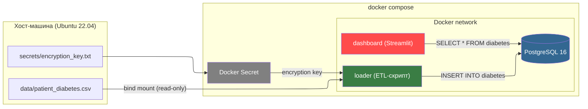

# Лабораторная работа 2. Упаковка многокомпонентного аналитического приложения с помощью Docker и Docker Compose.

## Выполнила Савкина Мария, группа БД-251м

## Вариант 25

*Бизнес-задача:* Диабет (Риски)	

*Проектная задача:* loader: Скрипт анонимизации данных перед загрузкой.	

*Техническое задание:* Использовать секреты (Docker Secrets или эмуляцию через файлы), чтобы передать ключи шифрования, а не через ENV.

## 1. Архитектура решения.

## 4. Описание компонентов

### 4.1. Датасет diabetes_new.csv

Дата-сет получен из открытого набора данных с Kaggle: https://www.kaggle.com/datasets/mathchi/diabetes-data-set путём добавления полей FirstName и SecondName для дальнейшей анонимизации данных в рамках проектной задачи Варианта 25.

Поля набора данных:
| Поле                        | Тип       | Описание                                                                                   |
|------------------------------|----------|-------------------------------------------------------------------------------------------|
| Pregnancies                  | INT      | Количество беременностей                                                                   |
| Glucose                      | INT      | Концентрация глюкозы в плазме через 2 часа после перорального теста на толерантность       |
| BloodPressure                | INT      | Диастолическое артериальное давление (мм рт. ст.)                                         |
| SkinThickness                | INT      | Толщина кожной складки на трицепсе (мм)                                                  |
| Insulin                      | INT      | Уровень инсулина в сыворотке крови через 2 часа (мМЕ/мл)                                  |
| BMI                          | FLOAT    | Индекс массы тела (вес в кг / (рост в м)²)                                                 |
| DiabetesPedigreeFunction     | FLOAT    | Функция родословной для выявления риска диабета                                           |
| Age                          | INT      | Возраст пациента (лет)                                                                    |
| Outcome                      | INT      | Переменная класса (0 — нет диабета, 1 — диабет)                                          |
| FirstName                    | STRING   | Имя пациента                                                                             |
| LastName                     | STRING   | Фамилия пациента                                                                         |
