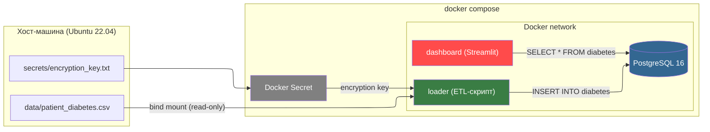

# Лабораторная работа 2. Упаковка многокомпонентного аналитического приложения с помощью Docker и Docker Compose.

## Выполнила Савкина Мария, группа БД-251м

## Вариант 25

*Бизнес-задача:* Диабет (Риски)	

*Проектная задача:* loader: Скрипт анонимизации данных перед загрузкой.	

*Техническое задание:* Использовать секреты (Docker Secrets или эмуляцию через файлы), чтобы передать ключи шифрования, а не через ENV.

## Архитектура решения.

