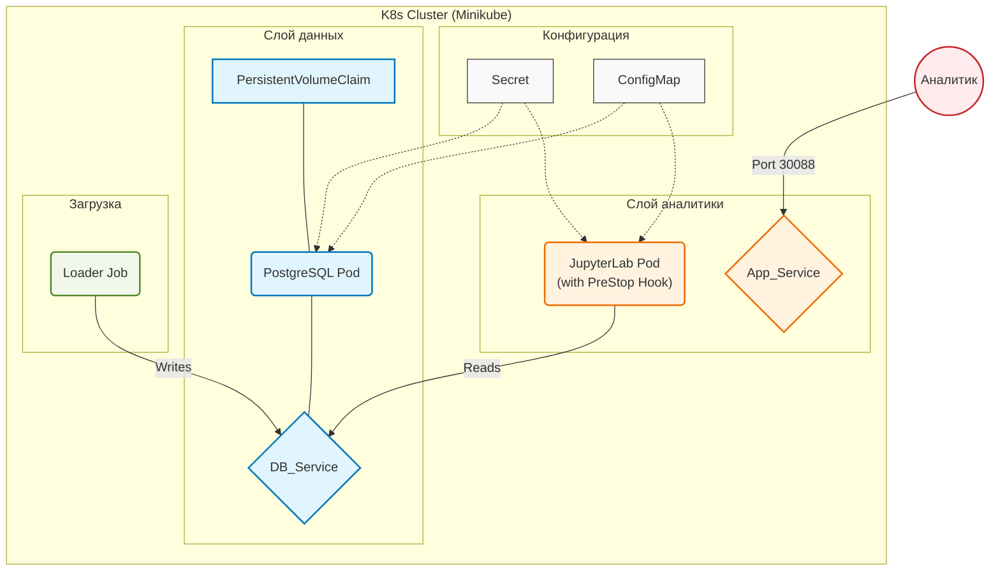

# Лабораторная работа 3. Развертывание простого приложения в Kubernetes.

## Выполнила Савкина Мария, группа БД-251м

## Вариант 25

*Бизнес-задача:* Диабет (Риски)	

*Проектная задача:* Diabetes Risk

*Техническое задание (Kubernetes Manifest Feature):* Использовать PreStop Hook для корректного завершения соединений перед удалением пода.

---

## 1. Цель работы
Получить практические навыки оркестрации контейнеризированных приложений в среде Kubernetes. Выполнить миграцию архитектуры из Docker Compose в K8s, настроить управление конфигурациями (ConfigMaps/Secrets), обеспечить персистентность данных (PVC), настроить проверки жизнеспособности (Probes) и привязать кастомный ServiceAccount.

## 2. Технический стек и окружение
- **ОС:** Ubuntu 24.04 LTS
- **Контейнеризация:** Docker 29.2.1
- **Оркестрация:** Minikube (Driver: Docker), Kubernetes (kubectl)
- **База данных:** PostgreSQL 15 (Alpine)
- **Язык программирования:** Python 3.10
- **Аналитическая среда:** JupyterLab (scipy-notebook)
- **Библиотеки:** `psycopg2-binary`, `pandas`, `sqlalchemy`, `seaborn`, `matplotlib`

---

## 3. Архитектура решения

**PreStop Hook имеет смысл только для контейнеров, которые обрабатывают клиентские запросы и поддерживают активные соединения.**
**В представленном кейсе случае это контейнер приложения (Jupyter)**

### Таблица пояснения компонентов архитектуры

| Блок | Компонент | Краткое пояснение |
| :--- | :--- | :--- |
| **Configs** | Secret/ConfigMap/SA | Хранилище конфиденциальных данных (логин/пароль БД) и параметров подключения. |
| **Database** | PostgreSQL / PVC | База данных для хранения медицинских данных (`diabetes_risk`). `PersistentVolumeClaim` обеспечивает сохранность данных при пересоздании pod. |
| **Analytics** | JupyterLab | Аналитическая среда для работы с данными. Использует `initContainer` для ожидания БД, `liveness/readiness probes` для контроля состояния и **PreStop Hook** для корректного завершения соединений. |
| **Data** | Loader Job | Одноразовый batch-процесс, генерирующий синтетические медицинские данные и записывающий их в таблицу `diabetes_risk`.    |
| **User** | Analyst | Внешний пользователь, получающий доступ к JupyterLab через `NodePort` (порт 30088). |
