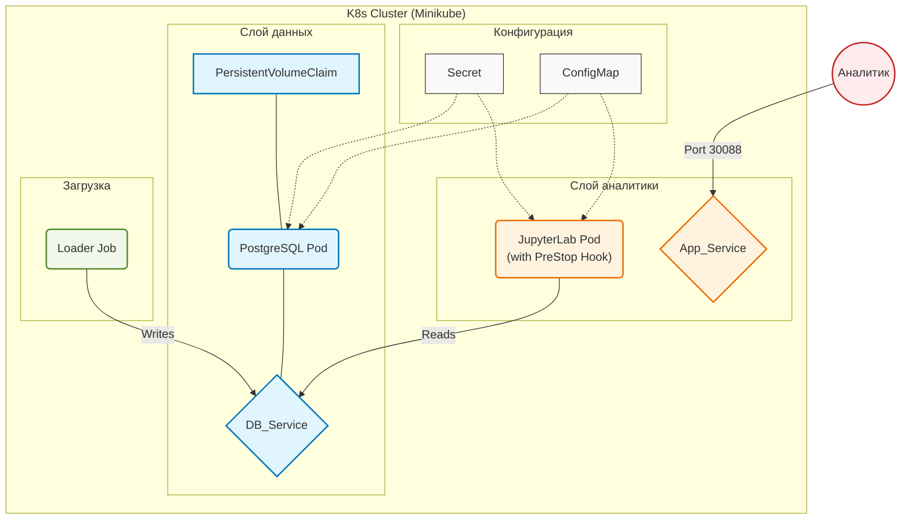

# Лабораторная работа 3. Развертывание простого приложения в Kubernetes.

## Выполнила Савкина Мария, группа БД-251м

## Вариант 25

*Бизнес-задача:* Диабет (Риски)	

*Проектная задача:* Diabetes Risk

*Техническое задание (Kubernetes Manifest Feature):* Использовать PreStop Hook для корректного завершения соединений перед удалением пода.

---

## 1. Цель работы
Получить практические навыки оркестрации контейнеризированных приложений в среде Kubernetes. Выполнить миграцию архитектуры из Docker Compose в K8s, настроить управление конфигурациями (ConfigMaps/Secrets), обеспечить персистентность данных (PVC), настроить проверки жизнеспособности (Probes) и привязать кастомный ServiceAccount.

## 2. Технический стек и окружение
- **ОС:** Ubuntu 24.04 LTS
- **Контейнеризация:** Docker 29.2.1
- **Оркестрация:** Minikube (Driver: Docker), Kubernetes (kubectl)
- **База данных:** PostgreSQL 15 (Alpine)
- **Язык программирования:** Python 3.10
- **Аналитическая среда:** JupyterLab (scipy-notebook)
- **Библиотеки:** `psycopg2-binary`, `pandas`, `sqlalchemy`, `seaborn`, `matplotlib`

---


## 3. Архитектура решения


**PreStop Hook имеет смысл только для контейнеров, которые обрабатывают клиентские запросы и поддерживают активные соединения.**
**В представленном кейсе случае это контейнер приложения (Jupyter)**

### Таблица пояснения компонентов архитектуры

| Блок | Компонент | Краткое пояснение |
| :--- | :--- | :--- |
| **Configs** | Secret/ConfigMap/SA | Хранилище конфиденциальных данных (логин/пароль БД) и параметров подключения. |
| **Database** | PostgreSQL / PVC | База данных для хранения медицинских данных (`diabetes_risk`). `PersistentVolumeClaim` обеспечивает сохранность данных при пересоздании pod. |
| **Analytics** | JupyterLab | Аналитическая среда для работы с данными. Использует `initContainer` для ожидания БД, `liveness/readiness probes` для контроля состояния и **PreStop Hook** для корректного завершения соединений. |
| **Data** | Loader Job | Одноразовый batch-процесс, генерирующий синтетические медицинские данные и записывающий их в таблицу `diabetes_risk`.    |
| **User** | Analyst | Внешний пользователь, получающий доступ к JupyterLab через `NodePort` (порт 30088). |

## 4. Структура проекта

Все файлы проекта доступны в папке [var25_lw3](./var25_lw3/)

  

## 4.1. Исходный код Docker-образов (Локальная сборка)
### Скрипт загрузки данных (Loader)
**Файл `loader/Dockerfile`:**
```dockerfile
FROM python:3.10-slim
RUN pip install psycopg2-binary
COPY loader.py /app/loader.py
CMD ["python", "/app/loader.py"]
```

**Файл `loader/loader.py`:**
```python
import psycopg2, os, random, time

print("Waiting for DB to be fully ready...")
time.sleep(5)

conn = psycopg2.connect(
    host=os.getenv("DB_HOST"),
    port=os.getenv("DB_PORT", "5432"),
    dbname=os.getenv("POSTGRES_DB"),
    user=os.getenv("POSTGRES_USER"),
    password=os.getenv("POSTGRES_PASSWORD"),
)
cur = conn.cursor()
cur.execute(
    "CREATE TABLE IF NOT EXISTS diabetes_risk (id SERIAL PRIMARY KEY, age INT, bmi FLOAT, glucose FLOAT, blood_pressure FLOAT, insulin FLOAT, risk_score FLOAT, risk_level TEXT);"
)


# Определяем специальные функции для сохранения бизнес-логики
def calculate_risk(age, bmi, glucose, bp):
    score = 0
    if age > 45:
        score += 0.2
    if bmi > 30:
        score += 0.3
    if glucose > 140:
        score += 0.4
    if bp > 140:
        score += 0.1

    return min(score, 1.0)


def risk_label(score):
    if score < 0.3:
        return "low"
    elif score < 0.6:
        return "medium"
    return "high"

# Генерируем данные с учетом особенностей медицинских показателей
for _ in range(1000):
    age = random.randint(18, 80)
    # BMI (с возрастом увеличивается)
    bmi = round(random.gauss(27 + (age > 50) * 2, 4), 2)
    # Глюкоза зависит от BMI и возраста
    glucose_base = 90 + (bmi - 25) * 2 + (age - 40) * 0.5
    glucose = round(random.gauss(glucose_base, 15), 2)
    # Давление зависит от возраста
    blood_pressure = round(random.gauss(110 + (age - 40) * 0.5, 10), 2)
    # Инсулин (связан с глюкозой)
    insulin = round(random.gauss(80 + (glucose - 100) * 0.7, 30), 2)

    risk = calculate_risk(age, bmi, glucose, blood_pressure)
    label = risk_label(risk)

    cur.execute(
        """
        INSERT INTO diabetes_risk 
        (age, bmi, glucose, blood_pressure, insulin, risk_score, risk_level)
        VALUES (%s, %s, %s, %s, %s, %s, %s)
    """,
        (age, bmi, glucose, blood_pressure, insulin, risk, label),
    )

conn.commit()
print("Diabetes risk data loaded successfully!")
cur.close()
conn.close()
```

### Образ JupyterLab
**Файл `app/Dockerfile`:**
```dockerfile
FROM jupyter/scipy-notebook:latest
RUN pip install psycopg2-binary sqlalchemy seaborn matplotlib
ENV JUPYTER_ENABLE_LAB=yes
```

## 4.2. Манифесты Kubernetes

### `k8s/01-config-secret.yaml`
```yaml
apiVersion: v1
kind: Secret
metadata:
  name: db-secret
type: Opaque
data:
  POSTGRES_USER: YWRtaW4=
  POSTGRES_PASSWORD: YWRtaW4=
---
apiVersion: v1
kind: ConfigMap
metadata:
  name: app-config
data:
  POSTGRES_DB: "diabetesdb"
  DB_HOST: "db-service"
  DB_PORT: "5432"
---
apiVersion: v1
kind: PersistentVolumeClaim
metadata:
  name: postgres-pvc
spec:
  accessModes:
    - ReadWriteOnce
  resources:
    requests:
      storage: 1Gi
```

### `k8s/02-pvc.yaml`
```yaml
apiVersion: v1
kind: PersistentVolumeClaim
metadata:
  name: postgres-pvc
spec:
  accessModes:
    - ReadWriteOnce
  resources:
    requests:
      storage: 1Gi
```

### `k8s/03-db.yaml`
```yaml
apiVersion: apps/v1
kind: Deployment
metadata:
  name: db-deployment
spec:
  replicas: 1
  selector:
    matchLabels:
      app: db
  template:
    metadata:
      labels:
        app: db
    spec:
      containers:
      - name: postgres
        image: postgres:15-alpine
        env:
        - name: POSTGRES_USER
          valueFrom:
            secretKeyRef:
              name: db-secret
              key: POSTGRES_USER
        - name: POSTGRES_PASSWORD
          valueFrom:
            secretKeyRef:
              name: db-secret
              key: POSTGRES_PASSWORD
        - name: POSTGRES_DB
          valueFrom:
            configMapKeyRef:
              name: app-config
              key: POSTGRES_DB
        volumeMounts:
        - mountPath: /var/lib/postgresql/data
          name: db-data
      volumes:
      - name: db-data
        persistentVolumeClaim:
          claimName: postgres-pvc
---
apiVersion: v1
kind: Service
metadata:
  name: db-service
spec:
  type: ClusterIP
  selector:
    app: db
  ports:
  - port: 5432
    targetPort: 5432
```

### `k8s/04-app.yaml`

**Добавлен PreStop Hook**

```yaml
apiVersion: apps/v1
kind: Deployment
metadata:
  name: app-deployment
spec:
  replicas: 1
  selector:
    matchLabels:
      app: jupyter
  template:
    metadata:
      labels:
        app: jupyter
    spec:
      initContainers:
      - name: wait-for-db
        image: busybox:1.28
        command:
        - "sh"
        - "-c"
        - "until nc -z db-service 5432; do echo waiting for db; sleep 2; done;"
      containers:
      - name: jupyter
        image: diabetes-jupyter:v1
        imagePullPolicy: Never
        lifecycle:
          preStop:
            exec:
              command: ["sh", "-c", "echo 'Closing connections...'; sleep 10"]
        ports:
        - containerPort: 8888
        envFrom:
        - configMapRef:
            name: app-config
        - secretRef:
            name: db-secret
        livenessProbe:
          httpGet:
            path: /api
            port: 8888
          initialDelaySeconds: 15
          periodSeconds: 10
        readinessProbe:
          httpGet:
            path: /api
            port: 8888
          initialDelaySeconds: 10
          periodSeconds: 5
---
apiVersion: v1
kind: Service
metadata:
  name: app-service
spec:
  type: NodePort
  selector:
    app: jupyter
  ports:
  - port: 8888
    targetPort: 8888
    nodePort: 30088
```

### `k8s/05-job.yaml`
```yaml
apiVersion: batch/v1
kind: Job
metadata:
  name: data-loader-job
spec:
  template:
    spec:
      containers:
      - name: loader
        image: diabetes-loader:v1
        imagePullPolicy: Never
        envFrom:
        - configMapRef:
            name: app-config
        - secretRef:
            name: db-secret
      restartPolicy: OnFailure
```

## 5. Выполнение работы

1. **Запуск:** `minikube start --driver=docker`


2. **Сборка**
   ```bash
   eval $(minikube docker-env)
   docker build -t diabetes-loader:v1 ./loader
   docker build -t diabetes-jupyter:v1 ./app
   ```


3. **Развертывание:** `kubectl apply -f k8s/`


4. **Проверка доступности:** `minikube service app-service` (откроет браузер).
5. **Логи для входа (token):** `kubectl logs deployment/app-deployment | grep token`


**JupyterLab запущен на localhost:**


## 6. Аналитика в JupyterLab

**Блокнот [var25_lw3.ipynb](./var25_lw3.ipynb)**

```python
import os
import pandas as pd
import matplotlib.pyplot as plt
import seaborn as sns
from sqlalchemy import create_engine

db_url = f"postgresql+psycopg2://{os.getenv('POSTGRES_USER')}:{os.getenv('POSTGRES_PASSWORD')}@{os.getenv('DB_HOST')}:{os.getenv('DB_PORT')}/{os.getenv('POSTGRES_DB')}"
engine = create_engine(db_url)

df = pd.read_sql("SELECT * FROM diabetes_risk;", engine)
print(f"Всего записей: {len(df)}")
print(df.head())

risk_order = ["low", "medium", "high"]

#Распределение уровней риска
sns.set_theme(style="whitegrid")
ax = sns.countplot(
    data=df, 
    x="risk_level", 
    order=risk_order,
    hue="risk_level", 
    palette="YlOrRd"
)

for p in ax.patches:
    ax.annotate(f'{int(p.get_height())}', 
                (p.get_x() + p.get_width() / 2., p.get_height()), 
                ha='center', va='bottom', fontsize=12)

plt.title("Распределение уровней риска", fontsize=14)
plt.show()
```


```python
# Распределение возраста по уровням риска
sns.set_theme(style="white", palette="muted")
plt.figure(figsize=(12, 7))

# 1Boxplot
sns.boxplot(
    data=df, x="risk_level", y="age",
    width=0.15,
    color="white", 
    order=risk_order,
)

# Violinplot (эффект тени)
sns.violinplot(
    data=df, x="risk_level", y="age", 
    hue="risk_level", 
    palette="viridis",
    inner=None,      # Убираем внутренние элементы виолина
    alpha=0.1, 
    bw_adjust=.5, 
    legend=False
)

plt.title("Распределение возраста по уровням риска", fontsize=16, fontweight='bold', pad=20)
plt.xlabel("Уровень риска", fontsize=12, labelpad=10)
plt.ylabel("Возраст (лет)", fontsize=12, labelpad=10)
plt.grid(axis='y', linestyle='--', alpha=0.3)

plt.tight_layout()
plt.show()
```


```python
# Взаимосвязь медицинских показателей
cols = ["age", "bmi", "glucose", "blood_pressure", "insulin", "risk_score"]
corr = df[cols].corr()
plt.figure(figsize=(10, 8))

sns.heatmap(
    corr, 
    annot=True, 
    fmt=".2f", 
    cmap='RdBu_r', 
    center=0,
    square=True, 
    linewidths=1.5,
    cbar_kws={"shrink": .7},
    linecolor='white' 
)

plt.title("Взаимосвязь медицинских показателей", fontsize=16, fontweight='bold', pad=20)
plt.xticks(rotation=45, ha='right')
plt.yticks(rotation=0)

plt.tight_layout()
plt.show()
```


## 7. Проверка работоспособности

**Проверка логов кластера:**


**Проверка персистентности:**


**Проверка job:**


## 8. Отчистка от результатов работы

**Удаление всех ресурсов Kubernetes:**


**Отчистка докер-образов внутри Minikube:**


**Полное удаление кластера:**


## Вывод

В ходе выполнения лабораторной работы была успешно реализована и развернута контейнеризированная аналитическая система оценки рисков диабета в среде Kubernetes.

Разработанное решение представляет собой полноценный прототип распределенной аналитической системы, соответствующий современным практикам DevOps и облачной разработки. Полученные навыки могут быть применены при создании масштабируемых и устойчивых к отказам систем обработки данных в реальных проектах.