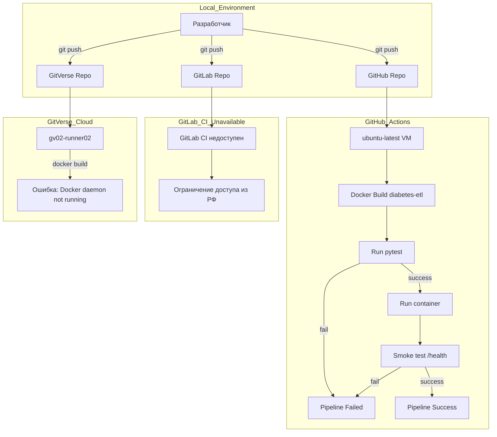

# Лабораторная работа №4. Автоматизация ETL-скрипта с помощью CI/CD (GitVerse, GitLab, GitHub)

## Цель работы
Настроить автоматический конвейер непрерывной интеграции (CI) для аналитического ETL-компонента в сфере логистики. Реализовать автоматическую сборку Docker-образов, тестирование и сценарий "Smoke Test" (Запустить контейнер, сделать curl localhost:port/health. Если 200 OK — успех.). 

Исследовать инфраструктурные особенности и ограничения облачных раннеров на трех различных платформах: GitVerse, GitLab CI и GitHub Actions.

## Постановка задачи (Вариант 25)
*   **Доменная область.** Здравоохранения
*   **Компонент.** ETL-скрипт обработки данных о выявлении диабета.
*   **Платформы CI/CD.** GitVerse (СберТех), GitLab (SaaS) и GitHub.
*   **Сценарий проверки (Quality Gate).** Smoke Test.
*   **Техническое требование.** Запуск контейнера, curl localhost:port/health. 
## Архитектура решения и процесс миграции



## Технический стек
*   **ОС для локальной разработки:** Ubuntu 22.04.
*   **Контейнеризация:** Docker.
*   **CI/CD Платформы:** GitVerse CI, GitLab CI, GitHub Actions.
*   **Язык ETL:** Python 3.11 (pandas, pytest).

---

## Видео о работе проекта: [Видео](https://disk.yandex.ru/i/VrsSdia9Vy_AEA)

## Структура проекта


## Часть 1. Подготовка проекта и запуск в GitVerse

### 1.1. Создание исходного кода
Файл **`diabetes_etl.py`**:
```python
import pandas as pd

def clean_diabetes_data(data: list) -> pd.DataFrame:
    df = pd.DataFrame(data)
    
    # Удаляем записи без patient_id
    if 'patient_id' in df.columns:
        df = df.dropna(subset=['patient_id'])
    
    # Удаляем записи без уровня глюкозы
    if 'glucose_level' in df.columns:
        df = df[df['glucose_level'].notna()]
    
    # Удаляем некорректный возраст (отрицательный или больше 120)
    if 'age' in df.columns:
        df = df[(df['age'] >= 0) & (df['age'] <= 120)]
    
    return df


if __name__ == "__main__":
    raw_data = [
        {"patient_id": "P001", "glucose_level": 7.8, "age": 45, "status": "prediabetes"},
        {"patient_id": None, "glucose_level": 5.5, "age": 30, "status": "normal"},
        {"patient_id": "P002", "glucose_level": None, "age": 50, "status": "unknown"},
        {"patient_id": "P003", "glucose_level": 9.1, "age": -5, "status": "diabetes"},
    ]
    
    print(clean_diabetes_data(raw_data))

from fastapi import FastAPI

app = FastAPI()

@app.get("/health")
def health():
    return {"status": "ok"}
```

Тесты **`test_etl.py`**:
```python
import pandas as pd
from diabetes_etl import clean_diabetes_data

def test_clean_diabetes_data():
    raw_data = [
        {"patient_id": "P001", "glucose_level": 7.8, "age": 45, "status": "prediabetes"},
        {"patient_id": None, "glucose_level": 5.5, "age": 30, "status": "normal"},
        {"patient_id": "P002", "glucose_level": None, "age": 50, "status": "unknown"},
        {"patient_id": "P003", "glucose_level": 9.1, "age": -5, "status": "diabetes"},
    ]
    
    df = clean_diabetes_data(raw_data)
    
    # Должна остаться только одна валидная запись
    assert len(df) == 1
    
    # Проверяем значения
    assert df.iloc[0]['patient_id'] == "P001"
    assert df.iloc[0]['glucose_level'] == 7.8
    assert df.iloc[0]['age'] == 45
    assert df.iloc[0]['status'] == "prediabetes"
```

**`requirements.txt`**:
```text
pandas==2.1.4
pytest==7.4.3
fastapi==0.110.0
uvicorn==0.27.0
```

**`Dockerfile`**:
```dockerfile
FROM python:3.11-slim

WORKDIR /app

# Устанавливаем curl (для smoke-теста)
RUN apt-get update && apt-get install -y curl && rm -rf /var/lib/apt/lists/*

COPY requirements.txt .
RUN pip install --no-cache-dir -r requirements.txt

COPY . .

CMD ["uvicorn", "diabetes_etl:app", "--host", "0.0.0.0", "--port", "8000"]
```

### 1.2. Настройка GitVerse Pipeline
Конфигурация **`.gitverse/workflows/gitverse_pipline.yaml`**:
```yaml
name: Diabetes ETL Pipeline

on:
  push:
    branches: [ main ]

jobs:
  test-and-smoke:
    runs-on: ubuntu-latest

    steps:
      - name: Checkout repository
        uses: actions/checkout@v4

      - name: Build Docker image
        run: docker build -t diabetes-etl:smoke .

      - name: Run unit tests
        run: docker run --rm diabetes-etl:smoke pytest

      - name: Run container
        run: |
          docker run -d --name etl-smoke diabetes-etl:smoke
          sleep 5

      - name: Smoke test (health check)
        run: docker exec etl-smoke curl -f http://127.0.0.1:8000/health
```

### 1.3. Авторизация и ошибка в GitVerse
Отправка проекта на GitVerse:

Инициализация гита:
```bash
git init
git config --global user.name "Ваше Имя"
git config --global user.email "ваш_email@example.com"
```


```bash
git add .
git commit -m "Init project"
git branch -M main
git remote add gitverse https://<ЛОГИН>:<ТОКЕН>@gitverse.ru/<ЛОГИН>/logistics-etl-ci.git
git push -u gitverse main
```


**Результат в GitVerse.** Пайплайн падает на шаге `Build Docker Image` с ошибкой `Cannot connect to the Docker daemon`. 


**Причина.** Облачные раннеры GitVerse работают в урезанных контейнерах без запущенного Docker-демона.

---

## Часть 2. Миграция CI/CD в GitLab (Docker-in-Docker)

### 2.1. Настройка GitLab CI
Создайте файл **`.gitlab-ci.yml`** в корне проекта:
```yaml
# .gitlab-ci.yml
stages:
  - build
  - test
  - smoke

variables:
  IMAGE_NAME: "logistics-etl:smoke"
  CONTAINER_NAME: "etl-smoke"

# Stage 1: Build Docker image
build:
  stage: build
  image: docker:24.0.5  # версия Docker CLI
  services:
    - docker:24.0.5-dind
  script:
    - docker build -t $IMAGE_NAME .

# Stage 2: Run unit tests
unit_tests:
  stage: test
  image: docker:24.0.5
  services:
    - docker:24.0.5-dind
  script:
    - docker run --rm $IMAGE_NAME pytest

# Stage 3: Run container and smoke test
smoke_test:
  stage: smoke
  image: docker:24.0.5
  services:
    - docker:24.0.5-dind
  script:
    - docker run -d --name $CONTAINER_NAME $IMAGE_NAME
    - sleep 5
    - docker exec $CONTAINER_NAME curl -f http://127.0.0.1:8000/health
```

### 2.2. Отправка в GitLab

Инициализация гита:
```bash
git init
git config --global user.name "Ваше Имя"
git config --global user.email "ваш_email@example.com"
```

```bash
git add .
git commit -m "Init project"
git branch -M main
git remote add gitlab https://wyamka:<ТОКЕН>@gitlab.com/wyamka/Lab4.git
git push -u gitlab main
```

**Результат:** Пайплайн не запускается из-за необходимости авторизации по номеру телефона, однако недоступности авторизации с помощью Российского номера телефона.


---

## Часть 3. Миграция CI/CD в GitHub (Нативный Docker)

Платформа GitHub Actions предоставляет полноценные виртуальные машины (VM) Ubuntu, в которых Docker установлен и запущен по умолчанию. Архитектура конфигурации полностью идентична GitVerse (GitVerse является ее форком), но здесь она отработает без ошибок.

## Архитектура и технический стек
*   **Стек:** Python 3.11, Pandas (обработка), Pytest (тесты), Docker.

### 3.1. Создание конфигурации GitHub Actions
Конфигурация **`.github/workflows/github_pipline.yaml`**:
```yaml
name: Diabetes ETL Pipeline

on:
  push:
    branches: [ main ]

jobs:
  test-and-smoke:
    runs-on: ubuntu-latest

    steps:
      - name: Checkout repository
        uses: actions/checkout@v4

      - name: Build Docker image
        run: docker build -t diabetes-etl:smoke .

      - name: Run unit tests
        run: docker run --rm diabetes-etl:smoke pytest

      - name: Run container
        run: |
          docker run -d --name etl-smoke diabetes-etl:smoke
          sleep 5

      - name: Smoke test (health check)
        run: docker exec etl-smoke curl -f http://127.0.0.1:8000/health
```

### 3.2. Авторизация и отправка в GitHub

```bash
git init
git config --global user.name "Ваше Имя"
git config --global user.email "ваш_email@example.com"
```

```bash
git add .
git commit -m "Init project"
git branch -M main
git remote add github https://wyamka:<ТОКЕН>@github.com/wyamka/DevOps4Lab4.git
git push -u github main
```


## Баг-тест

В рамках выполнения работы был проведен баг-тест. Были внесены изменения в файл diabetes_etl.py (изменено неравенситво, используемое для проверки возраста). В рамках баг-теста было продемонстрированно, что некорректный код не прошел проверку, сервис GitHub продемонстрировал ошибку.


## Сравнительный анализ платформ CI/CD

### GitVerse (Анализ инфраструктурного барьера)
**Конфигурация.** `.gitverse/workflows/clean_up_pipeline.yaml`
**Результат.** **FAILED**
**Технический анализ.** Логи GitVerse показали ошибку `Cannot connect to the Docker daemon`. 
**Причина.** Облачные раннеры GitVerse (СберТех) запускаются в защищенных контейнерах, где доступ к `docker.sock` ограничен. 

### GitLab CI (Решение через Services)
**Конфигурация.** `.gitlab-ci.yml`
**Техническое решение.** Ошибка авторизации.
**Причина.** Необходимость авторизации для обхода майнеров и мошенников, однако невозможность авторизации с использованием российского номера телефона

### GitHub Actions (Финальная верификация)
**Конфигурация.** `.github/workflows/github_pipeline.yml`
**Результат.** **SUCCESS** (Время выполнения: 34 секунды).

**+ Баг тест**


---

---

## 7. Вывод
В ходе лабораторной работы был пройден полный цикл миграции CI-конвейера. 
1.  Выявлено критическое ограничение платформы **GitVerse** в части работы с Docker-демоном «из коробки».
2.  Выявлено критическое ограничение платформы **GitLabb** в части работы с пользователями из Российской Федерации.
3.  Проведена финальная валидация в **GitHub Actions**, где продемонстрировано успешное выполнение и результаты баг-тестирования.

Проект готов к масштабированию: очистка ресурсов позволяет запускать пайплайн неограниченное количество раз без риска блокировки аккаунта по лимитам хранилища.

